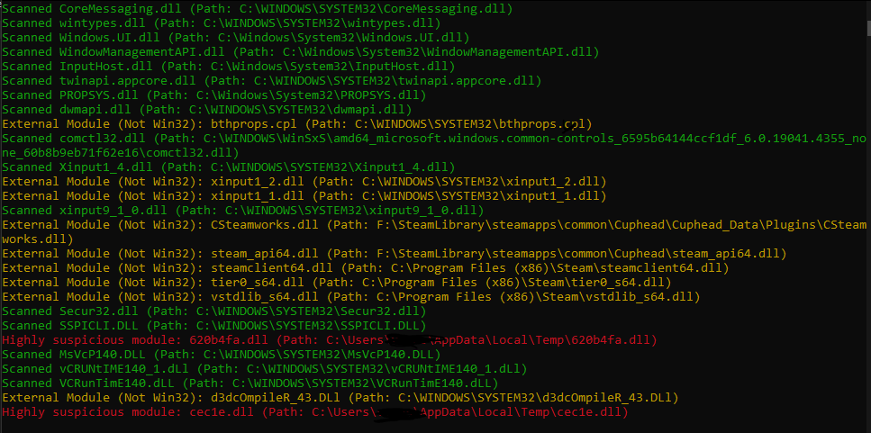

# Module-Scanning-Weak-Anticheat
Detect unauthorized modules injected into sensitive applications
 <h1>🔍 Process Module Scanner</h1>
  

    A Windows-based tool designed to monitor and detect potentially suspicious or external modules loaded by a specific process.
    This scanner helps identify unauthorized modules, monitor unusual activity, and validate module legitimacy against a remote server.

In this example I have injected two dlls (cheats) into a process and is detected a commonly placed dll file location in temp.
  

  <h2>✨ Features</h2>
  <ul>
    <li><strong>Process Monitoring:</strong> Locates and scans all modules associated with a specified process.</li>
    <li><strong>Suspicious Module Detection:</strong> Flags modules loaded from potentially insecure directories such as <code>Temp</code> or <code>Desktop</code>.</li>
    <li><strong>Server Validation:</strong> Communicates with a remote server to validate module legitimacy.</li>
    <li><strong>Real-Time Updates:</strong> Continuously scans for new modules and provides dynamic feedback.</li>
    <li><strong>Color-Coded Messaging:</strong> Outputs categorized messages for easy monitoring.</li>
  </ul>

  <h2>🔧 Key Technologies</h2>
  <ul>
    <li>C++ with Windows API</li>
    <li>Multi-threaded scanning for real-time detection</li>
    <li>HTTP communication using <code>wininet.h</code></li>
    <li>Custom console output via <code>ConsoleWriter</code></li>
  </ul>

  <h2>🚀 Usage</h2>
  <ol>
    <li>Compile and run the application.</li>
    <li>Specify the process name in <code>main()</code> (default: <code>steam.exe</code>).</li>
    <li>The scanner continuously monitors the process and outputs results to the console.</li>
  </ol>

  <h2>💼 Example Scenarios</h2>
  <ul>
    <li>Detect unauthorized modules injected into sensitive applications.</li>
    <li>Identify unusual or malicious behavior during runtime.</li>
    <li>Validate third-party modules to ensure system integrity.</li>
  </ul>

  <h2>📜 License</h2>
  
This project is licensed under the MIT License.

